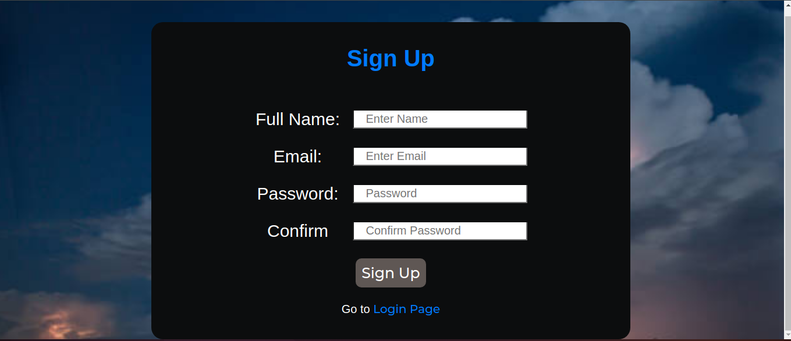
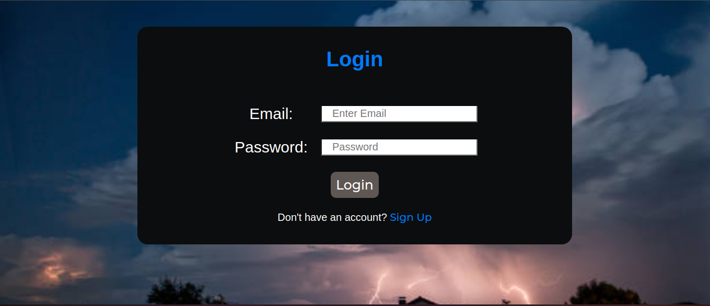
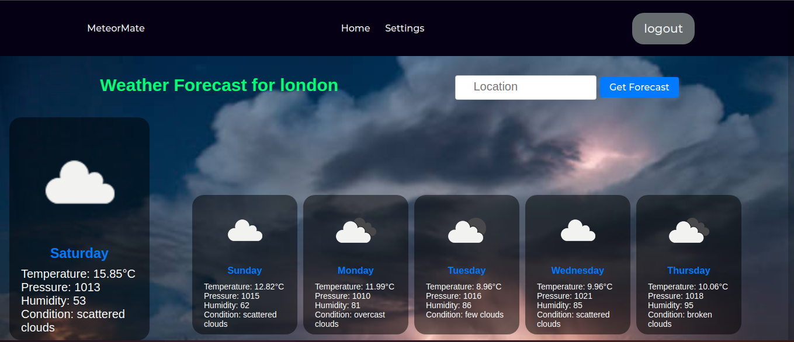

# MeteorMate

MeteorMate is a web application built with Flask that provides weather forecasts and current weather data using the OpenWeatherMap API. Users can register, log in, and manage their settings, including preferred units for temperature display.

## Features

- User registration and login
- Password hashing for secure storage
- Current weather data retrieval
- Weather forecast retrieval
- User session management
- Settings to choose preferred units for temperature

## Technologies Used

- **Flask**: Lightweight web framework for Python
- **Flask-Bcrypt**: Password hashing utilities
- **Flask-SQLAlchemy**: SQLAlchemy support for Flask applications
- **Flask-Login**: User session management
- **requests**: HTTP requests to fetch data from the OpenWeatherMap API
- **SQLite**: Lightweight, disk-based database

## Installation

Follow these steps to set up the project locally:

1. **Clone the repository:**

    ```sh
    git clone https://github.com/dawe014/MeteorMate.git
    cd MeteorMate
    ```

2. **Create a virtual environment:**

    ```sh
    python -m venv venv
    ```

3. **Activate the virtual environment:**

    - On Windows:

        ```sh
        venv\Scripts\activate
        ```

    - On macOS and Linux:

        ```sh
        source venv/bin/activate
        ```

4. **Install the dependencies:**

    ```sh
    pip install -r requirements.txt
    ```

5. **Set up the database:**

    Run the following command to create the SQLite database:

    ```sh
    python -c "from app import db, app; with app.app_context(): db.create_all()"
    ```

6. **Run the application:**

    ```sh
    python run.py
    ```

7. **Access the application:**

    Open your web browser and go to `http://127.0.0.1:5000/`.

## Configuration

Ensure you have the correct OpenWeatherMap API key set up in your `routes.py` file:

```python
API_KEY = 'your_openweathermap_api_key'
```

Replace `'your_openweathermap_api_key'` with your actual API key from OpenWeatherMap.

## Usage

1. **Registration:**
   - Visit the `/registration` route to create a new account.
   - 

2. **Login:**
   - Visit the `/login` route to log in with your credentials.
   - 

3. **Home Page:**
   - After logging in, you will be redirected to the home page.
   - 

4. **Weather Forecast:**
   - After logging in, visit the `/forecast` route to view the weather forecast.

5. **Settings:**
   - Adjust your preferred units for temperature (metric, imperial, or standard) in the settings.

## Project Structure

```plaintext
MeteorMate/
├── app/
│   ├── __init__.py
│   ├── decorators.py
│   ├── models.py
│   ├── routes.py
│   |── templates/
│   |   ├── index.html
│   |   ├── login.html
│   |   └── registration.html
│   └── static/
│       ├── css/
│       ├── images/
│       └── js/
├── screenshots/
│   ├── registration.png
│   ├── login.png
│   ├── home.png
├── requirements.txt
└── run.py
```

## Dependencies

Here are the main dependencies used in this project:

```txt
Flask==2.2.2
Flask-Login==0.6.2
Flask-SQLAlchemy==3.0.2
requests==2.28.1
click==8.1.3
itsdangerous==2.1.2
Jinja2==3.1.2
MarkupSafe==2.1.1
Werkzeug==2.2.2
SQLAlchemy==1.4.43
```

## Author

Dawit Tamiru (https://github.com/dawe014)
